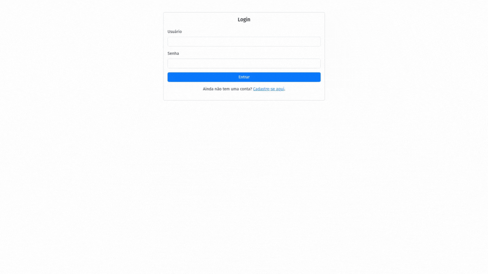

# ChatFlow AI



📝 **Description**  
ChatFlow AI is a chatbot project developed with Django. It allows users to register, log in, and interact with a virtual assistant powered by the Groq API. The conversation history is saved, allowing users to review their past interactions.

✨ **Features**  
- **User Authentication:** A complete registration and login system.
- **Intelligent Chatbot:** Real-time interaction with the Groq API.
- **Conversation History:** Chats are saved and can be accessed by the user at any time.
- **Simple Interface:** A clean and intuitive layout for a better user experience.

🚀 **Tech Stack**  
- **Backend:** Python, Django
- **Database:** PostgreSQL
- **API:** Groq
- **Containerization:** Docker, Docker Compose

---

⚙️ **Getting Started**  
Follow the steps below to run the project locally using Docker.

### Prerequisites  
- Docker
- Docker Compose

### Step-by-step Guide

1.  **Clone the repository:**

    ```bash
    git clone https://github.com/CFBruna/chatflow-ai.git
    cd chatflow-ai
    ```

2.  **Configure Your Environment:**  
    Copy the example environment file and fill in your specific values (especially `GROQ_API_KEY`).

    ```bash
    cp .env.example .env
    ```

3.  **Build and Run the Application:**  
    Run the following command to build the Docker images and start the containers.

    ```bash
    docker compose up --build
    ```
    The `-d` flag can be added to run the containers in detached mode.

4.  **Access the Application:**  
    Once the containers are running, open your browser and navigate to:  
    [http://localhost:8000](http://localhost:8000)

    The application should now be live. The first time you run it, Docker will build the necessary images, which may take a few minutes.

---

📜 **License**  
This project is under the MIT License. See the `LICENSE` file for more details.